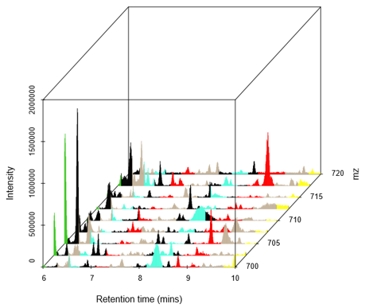

```{r setup, include=FALSE}
knitr::opts_chunk$set(echo = TRUE)
```

# Cefic MATCHING metabolomics data set 


The tutorial will use data generated as part of the the **Cefic MATCHING study**, the aim of which was was to conduct a blinded international ring-trial to investigate whether 6 metabolomics labs, each generating, analysing and reporting metabolomics data from a single exposure study (rodent plasma), generate the same grouping hypothesis [@viant2024demonstrating].

{width=300px}

Rather than use all the data from the study, the tutorial will focus only on male rats and the processed mass spectrometry data derived from the data collected as part from one of the ring-trial labs (Phenome Centre Birmingham).

We can unblind at the end of the tutorial (but if you can't wait go straight to the final stage of the tutorial!).

{width=300px}

&nbsp;

# Liquid chromatography mass spectrometry

Mass spectrometry coupled liquid chromatography (in particular high-resolution mass spectrometry with Ultra-high-performance liquid chromatography - UHPLC-MS) is an effective and popular approach for metabolomics and is what was used for data we are using for this tutorial. 

Full details of the methods found in the [supplemental of Cefic MATCHING publication](https://www.ncbi.nlm.nih.gov/pmc/articles/PMC10944399/bin/204_2024_3680_MOESM1_ESM.pdf) [@viant2024demonstrating].

The raw data collected from UHPLC-MS and LC-MS more generally can be thought of within 3 dimensions. 

* **Retention time (RT)**: This time at which the metabolites are eluted from the chromatography column based on the physiochemical properties of the metabolite
* **Mass-to-charge (*m/z*) **: The *m/z* of the metabolites that have been ionized to gas-phase ions then separated and detected by the mass spectrometer.
* **Intensity**: The intensity of each *m/z* - proportional to the number of ions detected (note though that without use of reference standards this cannot be directly used as the concentration due to various contributing factors e.g. ion suppression)


{width=400px}

&nbsp;

The UHPLC−MS approach used for our dataset consisited of four assays, comprising of two types of chromatography and two mass spectromety ionisation modes (positive and negative). The chromatographic columns being either a Hydrophilic Interaction Liquid "HILIC" column (primarily to measure polar metabolites) and a C18 column (primarily to measure lipids). These will be referred to as the following from now on:

* HILIC_POS
* HILIC_NEG
* LIPIDS_POS
* LIPIDS_NEG


We will be focusing only on one assay (HILIC_POS) for most steps in the tutorial to make the data analysis more managable.


# Sample metadata
So... lets finally read in some data. Let's begin with the metadata for the samples

We will be using data directly downloaded from the Github repository so the following root URL should be used. If you are using data downloaded 
locally this will need to be updated to the relative path of the data.

```{r root_dir_url}
root <- 'https://raw.githubusercontent.com/michabohealthscience/training-fsa/main'
```


```{r root_dir, echo=FALSE}
root <- '.'
```


The sample metadata is stored in a comma separated text file (.csv). We can read this into R using the `read.csv` function. This will save
the metadata as a `dataframe` R object.

```{r sample_metadata}
sample_metadata_all <- read.csv(file.path(root, 'data/HILIC_POS_male/0_sample_metadata.csv'))

```


Lets have a quick look at the sample metadata. We can use the `head` function to just see the first few rows

```{r sample_metadata_view}
head(sample_metadata_all)

```

We can use `View(sample_metadata)` in a more user friendly manner within RStudio where you can filter the columns


The following information regarding independent variables for each sample was available prior to unblinding:

* Test substances: TS1, TS2, TS3, TS4, TS5, TS7, TS8, TS9
* Doses: Low (1), High (2)
* Sex: Male

(TS6 was excluded prior to exposures).

Important to note here is that there are QC samples throughout the run. We will touch briefly on this later. All other 
samples are distributed randomly across the run (to help counteract any drift effects across the UHPLC−MS run). 

For each test_substance and dose there should be 5 biological replicates (i.e. 5 samples) for this dataset there is 1 technical replicate for each sample. 

The 'prep order' refers to the preparation of the samples (i.e. metabolite extraction), like the run order, the preparation order should be randomized across the samples to help counteract any bias effect this might have on the metabolite profiles.

# Feature metadata

For each assay there will also be metadata for each feature (this might also include the metabolite annotated to that feature). Due to the complexity of the data and metabolite annotation there can often be alot of metadata associated with each feature 

Lets just check quickly have a look at the *m/z* and RT values for HILIC POS.


```{r hilic_pos_feature_metadata}
feature_meta <- read.csv(file.path(root, 'data/HILIC_POS_male/0_feature_metadata.csv'))

# only select a few columns
feature_meta_reduced <- feature_meta[,c(1, 3, 6)]

head(feature_meta_reduced)
```

So for this assay alone we have `nrow(feature_meta_reduced)` metabolite features. However if we combine all the assays (HILIC_POS, HILIC_NEG, LIPIDS_POS, LIPID_NEG) for the male component of the data there are 28,664 features. 


# References {-}


