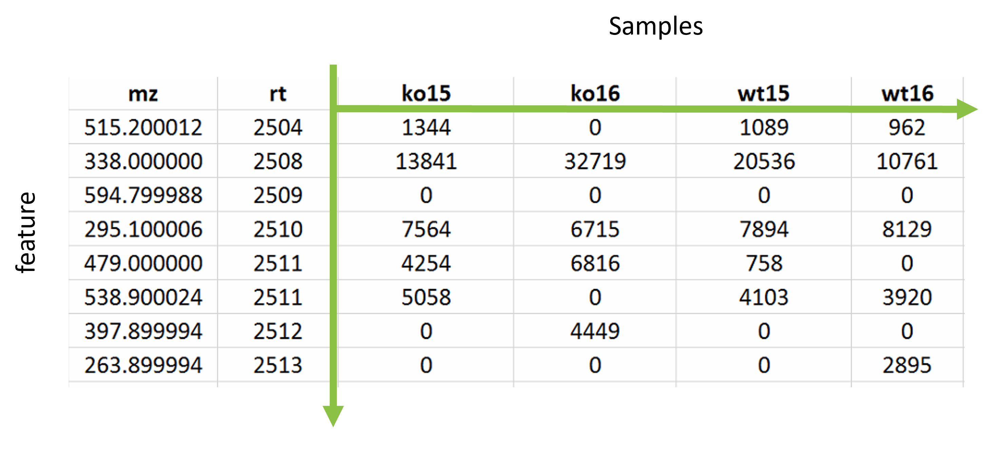

```{r setup, include=FALSE}
knitr::opts_chunk$set(echo = TRUE)
```


# Metabolomics data matrices

Metabolomics data is typically analysed as a matrix of **intensities** where one axis is for the **samples** that were analysed and the other for the **features**. Features being a specific *m/z* at a specific retention time.

{width=400px}
&nbsp;

The full data processing from raw mass spectrometry data to usable omics data matrix for grouping is beyond the scope 
of this tutorial. Instead we will work with a few key data matrices that have undergone standard metabolomics data processing, see [More info](6_more_info.html) for the details of how the data has been processed.


## Intensity data matrix


Let's start with the pre-filtered and pre-normalisation dataset to show what a typical metabolomics data matrix looks like.

First setup the root URL or path if not already done so.

```{r root_dir_url}
root <- 'https://raw.githubusercontent.com/michabohealthscience/training-fsa/main'
```


```{r root_dir, echo=FALSE}
root <- '.'
```

And let's read in the our first intensity matrix

```{r hilic_pos_intensity_unfiltered}
hilic_pos_all <- read.csv(file.path(root, 'data/HILIC_POS_male/1_unfiltered.csv'))
```

Again, `head(hilic_pos_all)` can be used for a quick check and `View(hilic_pos_all)` can be used to view in more detail.

The first column is a reference to the *m/z* and retention time of a feature and the columns are the samples.

Lets check how many samples and features we have for this data matrix. 

```{r hilic_pos_intensity_cols_rows, results = "hold"}
# feature count
feature_c_all = nrow(hilic_pos_all)
# sample count
samp_c_all = ncol(hilic_pos_all)-1

feature_c_all
samp_c_all

```
We can compare this the the filtered data matrix to see how many features have been removed due to the standard processing steps
```{r hilic_pos_intensity_filtered, results = "hold"}
hilic_pos_f <- read.csv(file.path(root, 'data/HILIC_POS_male/2_filtered.csv'))
```

For this dataset we should see that only 1 sample will be removed (the blank sample - as it is no longer required for furher analysis) and substantial number of the metabolite features will have been removed that were deemed not suitable for further analysis.


```{r hilic_pos_intensity_filtered_cols_rows, results = "hold"}

# feature count
feature_c_f = nrow(hilic_pos_f)
# sample count
samp_c_f = ncol(hilic_pos_f)-1


c('All samples:', samp_c_all)
c('Samples removed:', samp_c_all-samp_c_f)
c('Remaining samples:', samp_c_f)

c('All features:', feature_c_all)
c('Features removed:', feature_c_all-feature_c_f)
c('remaining features:', feature_c_f)
```

Now that we have a better understanding of metabolomics data matrices we can briefly explain the quality assessments before getting started on the statistical analysis.


