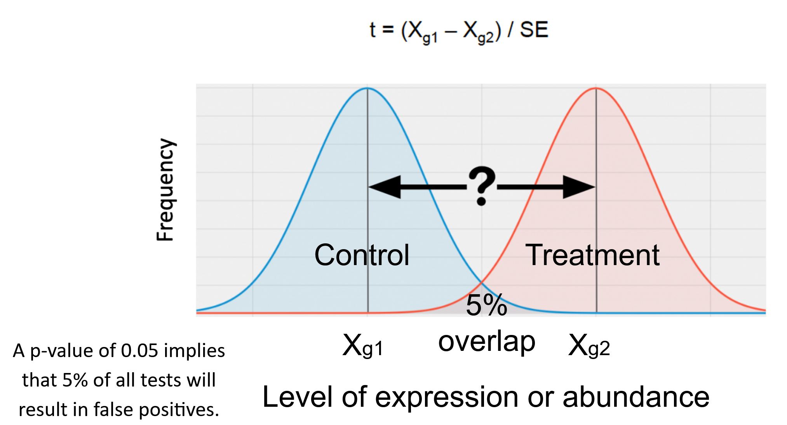
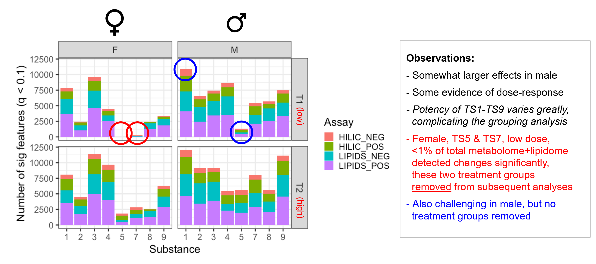

```{r setup, include=FALSE}
knitr::opts_chunk$set(echo = TRUE)
```

# Statistical analysis in metabolomics

For most metabolomics studies one or more of the following approaches will be used:

* Univariate statistics - where each feature is assessed separately (e.g. t-test)
* Multivariate (unsupervised) - where features are assessed together and without the use of training data (e.g. PCA)
* Multivariate (supervised) - where features are assessed together and with the use of labelled training data (e.g. PLS-DA)

In this training we will first use unsupervised multivariate analysis (principal component analysis - "PCA") to assess intensity data and then using univariate analysis (t-tests) to assess the differential abundant molecules compared to the control for each condition.


# PCA of intensity

PCA is unsupervised multivariate statistical approach that is used throughout the analysis of the metabolomics, it allows the high dimensionality of data where we have 1000s of features to be viewed by a smaller number of 'principal components'. These principal components are new variables constructed from linear combinations of the initial features where the first few principal components have the maximum amount of explained variation.

PCA has multiple applications (e.g. to check the quality of the data (i.e. previous section on QCs), to check for outliers, check each step in the data processing (all of which was done with this dataset by Phenome Centre Birmingham and used directly in the interpretation of the biological activity).

Here we will be looking at data that already been checked for data quality (including QC samples, outlier samples) and we are now assessing what we believe is valid bioactivity.

```{r root_dir_url, echo=FALSE}
root <- 'https://raw.githubusercontent.com/michabohealthscience/training-fsa/main'
```


```{r root_dir, echo=FALSE}
root <- '.'
```


```{r hilic_pos_glog}
# Read in the sample metadata and processed data matrix
sample_metadata <- read.csv(file.path(root, 'data/HILIC_POS_male/0_sample_metadata_filtered.csv'))
glog <- read.csv(file.path(root, 'data/HILIC_POS_male/5_glog.csv'), row.names = 1)


```


The PCA function within R `prcomp` needs to have the samples as rows and the features
as columns. So next we need transpose the data. 


```{r hilic_pos_glog_transpose}
# transpose 
glog_t <- t(glog)

```

Now let's remove the QC samples as they have already been used for the quality assessments and are no longer required.

```{r hilic_pos_glog_qc_remove}
qc_names <- sample_metadata[,1][sample_metadata$Class=='QC']
sample_metadata_no_qcs <- sample_metadata[sample_metadata$Class!='QC',]

glog_t_no_qcs <- glog_t[!rownames(glog_t) %in% qc_names,]

```

OK... finally ready to perform the PCA

```{r hilic_pos_glog_pca}
pca_no_qcs <- prcomp(glog_t_no_qcs, center = TRUE, scale. = TRUE)
```


We can plot using the `ggfortify` which automatically knows what to plot for PCA outputs from prcomp

```{r hilic_pos_glog_pca_plot}
library(ggfortify)
# the x and y variable can be adjusted to show compare different principal components

autoplot(pca_no_qcs, x=1, y=2, data=sample_metadata_no_qcs, colour="test_substance",  shape="dose_group", frame=TRUE, frame.colour = 'test_substance')+
  scale_colour_manual(values=c("khaki","black","blue", 'red', "grey",'orange', 'magenta', 'yellow', 'green', 'brown', 'purple'))+
  scale_fill_manual(values=c("khaki","black","blue", 'red', "grey",'orange', 'magenta', 'yellow', 'green', 'brown', 'purple'))+
  scale_shape_manual(values=c(4,8,2))+
  theme_bw()

```


> Whilst the above is useful and we can begin to see groups emerging - we are really interested in how similar each test substance treatment is compared to the control. So let's look at that in more detail


# Student t-test

Here we will the common univariate statistical, a two tailed t-test, to compare the means intensity values of the control and treated groups

There are two key metrics we will be using

* **t-statistic (or t-value)**
* **p-value**



&nbsp;


We will be using the the PQN normalised intensity matrix for this analysis (so missing value imputation and glog has not bee applied to the matrix)

```{r t-test_data}
pqn <- read.csv(file.path(root, 'data/HILIC_POS_male/3_pqn.csv'))

```

Lets start with doing a single t-test for one feature and one condition

```{r t-test_data_one_feature}
# Get all the control samples (i.e. all those with dose 0)
control_samples <- sample_metadata[,1][sample_metadata$dose_group==0]

# Get the high dose group (2) for test substance 1
ts1_dose_2_samples <- sample_metadata[,1][sample_metadata$dose_group==2 & sample_metadata$test_substance==1]

# Select the 2000th feature as an example
f2000 <- pqn[2000,]


controldf <- data.frame(intensity = unlist(f2000[,control_samples]), control_treated = 'control')

treateddf <- data.frame(intensity = unlist(f2000[,ts1_dose_2_samples]), control_treated = 'treated')

# Perform a t-test for this feature subset based on the chosen samples
ttest_out <- t.test(treateddf$intensity, controldf$intensity)

ttest_out

```

So we can see that the means for are signficantly different to one another for this feature. And this difference is obvious if we visualise the data as well


```{r boxplot_data_one_feature}

ctdf <- rbind(controldf, treateddf)

boxplot(intensity ~ control_treated, data = ctdf, frame = FALSE,  main=f2000['feature_name'])

```


We can use a few `for loops` in a `function` to calculate the t-test for all features for a specific test substance. Whilst we are here, we can also calculate the fold change difference between the control and treated means.


> **NOTE** - a function to do this is provided at the [**More info**](6_more_info.html) tab. If you already have some experience with R, feel free to run yourself otherwise just load in the output below. 


See below for a dataframe of all the t-stats, p-values and fold changes calculated for for test substance 2


```{r load_in_all_ttest_ts2}
ttest_ts2 <- read.csv(file.path(root, 'data/ttest_ts2.csv'))
```

Let's have a quick check of this dataframe. 
```{r check_result_p}
sum(ttest_ts2$pvalue<0.05)
```

Multiple testing correction is recommended when performing multiple t-tests to reduce the false positive results. 

Lets use the the `p.adjust` function to calculate adjusted p-values (i.e. q-values) with the 
`fdr` method i.e. the Benjamini & Hochberg approach. 


```{r check_result_q}
ttest_ts2$qvalue <- p.adjust(ttest_ts2$pvalue, method = 'fdr')
sum(ttest_ts2$qvalue<0.05)
```

So for this test substance we know we have a large number of metabolite features changing significantly.

Let's do a visualisation of this with a volcano plot to give a better idea of what is either moving "up" or "down".

```{r multiple_testing_correction}


ttest_ts2$diff <- 'NONE'
ttest_ts2$diff[ttest_ts2$tstat<0 & ttest_ts2$qvalue<0.05] <- 'DOWN'
ttest_ts2$diff[ttest_ts2$tstat>0 & ttest_ts2$qvalue<0.05] <- 'UP'


ggplot(data=ttest_ts2, aes(x=log2(fc), y=-log10(qvalue), col=diff)) +
        geom_point() + 
        theme_minimal() +
        scale_color_manual(values=c("blue", "black", "red")) +
        geom_vline(xintercept=c(-0.6, 0.6), col="red") +
        geom_hline(yintercept=-log10(0.05), col="red")


```

# Summary of t-tests
What about all the other test substances and other assays!

Rather than repeating this on all the test substances and all assays in this training we have a data file already created with the relevant t-stats that we can use for grouping in the next section.

Below we show a summary of all the t-test analysis done across all assays.

This was used as manual check to see if any of the test substance treatments were not exhibiting appropiate bioactivity and a decision was made to include in the grouping analysis or not.

Following a review of the data. It was deemed that for the male component, there was sufficient bioactivity to proceed to grouping without removing any test substance treatments. For the the female data however, treatment groups were removed.





