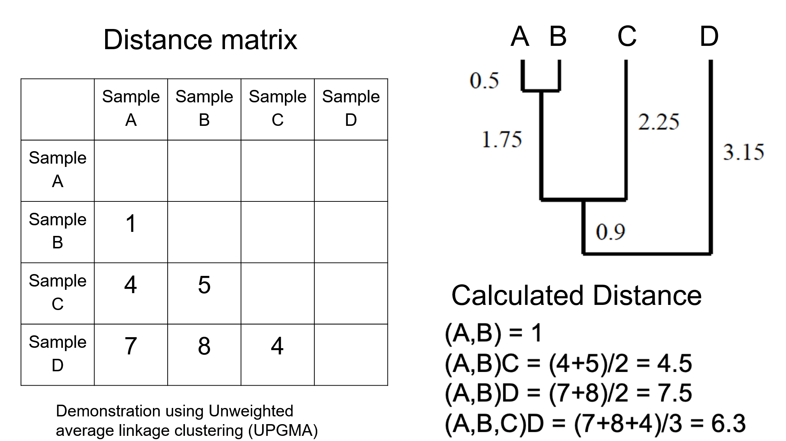
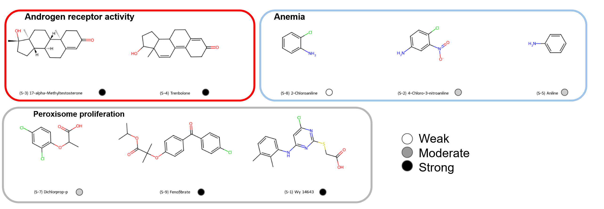
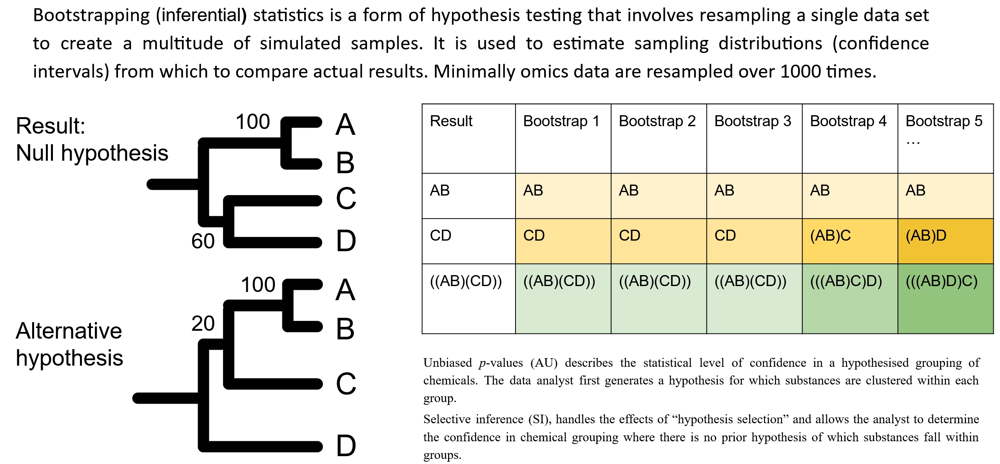
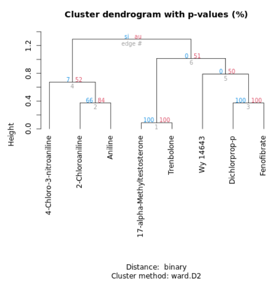

```{r setup, include=FALSE}
knitr::opts_chunk$set(echo = TRUE)
```

# t-statistic grouping
We have finally made it to the grouping!

For the Michabo Health Science workflow grouping we use the t-statistic calculated from the previous sections.

The benefit of using the t-statistic over other metrics (e.g. fold changes) is that variance is that the we are taking into consideration the variation between samples when comparing the means of the control and treated samples.


First get root URL for data
```{r root_dir_url}
root <- 'https://raw.githubusercontent.com/michabohealthscience/training-fsa/main'
```


```{r root_dir, echo=FALSE}
root <- '.'
```

Then read in the combined t-stats calculated for each assay, test substance and dose for male rodents.

```{r read_in_data_grouping}
tstats <- read.csv(file.path(root, 'data/combined_male_tstats.csv'), row.names = 1)

```


Now we vector normalise on each treatment condition. This is performed to minimise the impact of the potency of each test substance.

```{r rscaling}
tstats_scaled <- scale(tstats, center=FALSE, scale=TRUE)
```


# Hierarchical Cluster Analysis (HCA) on t-statistics

The focus of our grouping will be using Hierarchical Cluster Analysis (HCA) on the t-statistics. See below for some general principals on HCA.



&nbsp;

We will be using a package called `pvclust` to perform the HCA which calculates some additional measures of confidences that we will explore later


So let's run the grouping with pvclust. Using Euclidean distance matrix and the 'Ward.D2' method of clustering

```{r HCA_blind}
library(pvclust)
pvclust_res <- pvclust(tstats_scaled, method.dist="euclidean", method.hclust = "ward.D2", nboot=100)

plot(pvclust_res, c("si", "au", "bp"), hang=-1)


```


# Unblinding - compound and mode of action details


```{r table, tidy=FALSE, echo=FALSE}
data <- read.csv(file.path(root, 'data/cefic_matching_compounds.csv'), stringsAsFactors = FALSE, header = TRUE, check.names=FALSE)
knitr::kable((data), booktabs = TRUE,
caption = 'Table 5.1: Cefic MATCHING unblinded test substances')
```

&nbsp;




&nbsp;


# t-stat - HCA - unblinded

Lets do that again but this time with unblinded labelled columns 

```{r HCA_unblind, fig.height=8, fig.width=8}
library(pvclust)
unblinded_names <- read.csv(file.path(root, 'data/unblinded_ordered_names.csv'), header = TRUE)
colnames(tstats) <- unblinded_names$full_label

tstats_scaled <- scale(tstats, center=FALSE, scale=TRUE)

pvclust_res <- pvclust(tstats_scaled, method.dist="euclidean", method.hclust = "ward.D2",  nboot=100)

plot(pvclust_res, c("si", "au", "bp"), hang=-1)

```


# Assessing confidence in the grouping hypothesis



&nbsp;

# t-stat - PCA - unblinded

We can also represent the data using PCA 

```{r PCA_unblind, fig.height=6, fig.width=8}
library(ggplot2)
# transpose as features should be columns
tstats_scaled_t <- data.frame(t(tstats_scaled))

# Simply giving missing values a value of zero (but in practice this should be looked into more
# closely and missing value imputed approaches can be used
tstats_scaled_t[is.na(tstats_scaled_t)] <- 0

# remove features with no response
tstats_scaled_t_rm0 <- tstats_scaled_t[, colSums(tstats_scaled_t != 0) > 0]

# Run PCA
pca_tstats <- prcomp(tstats_scaled_t_rm0, center = TRUE, scale. = TRUE)
summ <- summary(pca_tstats)
tstats_scaled_t_rm0$full_label <- rownames(tstats_scaled_t_rm0)

pca_df <- data.frame(cbind(pca_tstats$x[,1:2], unblinded_names))

# Plot the PCA
ggplot(pca_df, aes(PC1, PC2, color=moa, label=moa)) + 
   geom_text(aes(label = compound_name_dose), hjust = 0.5,  vjust = -1) +
   geom_point(aes(color=moa)) +
   stat_ellipse(geom = "polygon", aes(fill = after_scale(alpha(colour, 0.3))))+
   scale_colour_manual(values=c("orange","black","blue"))+
   xlab(paste("PC1 (", round(summ$importance[2,1]*100,1), "%)", sep='')) +
   ylab(paste("PC2 (", round(summ$importance[2,2]*100,1), "%)", sep='')) +
    
   theme_bw()

```


# Chemical grouping using structure only

Lets compare this with the grouping using chemical structure only. See below for the same HCA approach but instead of using t-statistics for
the grouping we are using structural fingerprints of the test substance. 



&nbsp;


# References
