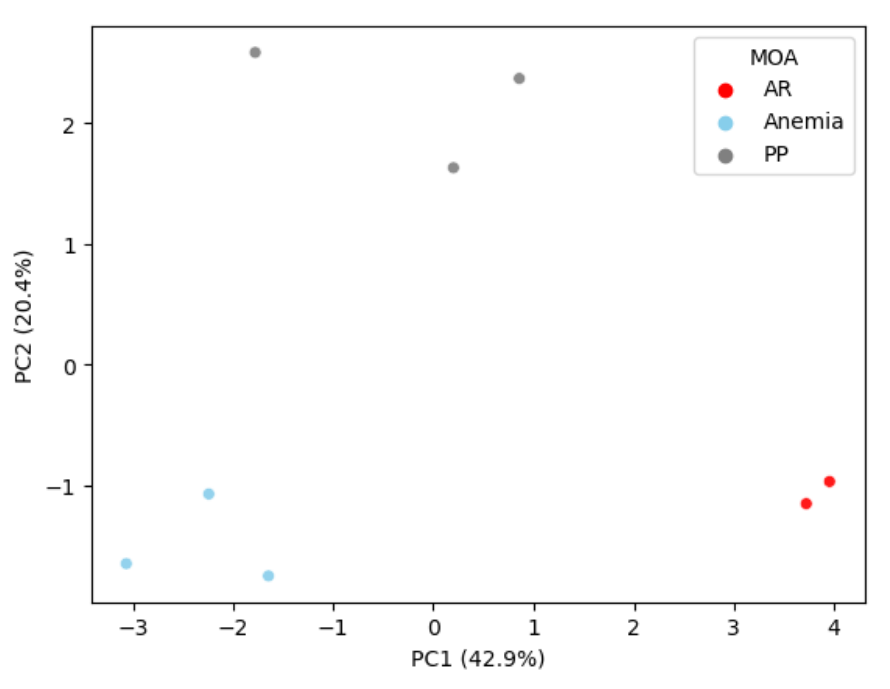

```{r setup, include=FALSE}
knitr::opts_chunk$set(echo = TRUE)
```


## Compound and mode of action details

```{r table, tidy=FALSE, echo=FALSE}
data <- read.csv('cefic_matching_compounds.csv', stringsAsFactors = FALSE, header = TRUE, check.names=FALSE)
knitr::kable((data), booktabs = TRUE,
caption = 'Table 4.1: Cefic MATCHING unblinded test substances')
```

&nbsp;


&nbsp;

## Chemical grouping using structure only

<!-- {width=400px} -->

<!-- &nbsp; -->


&nbsp;


