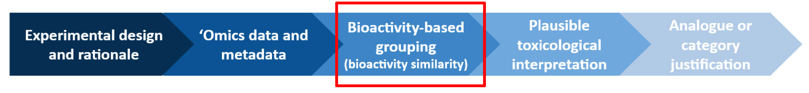
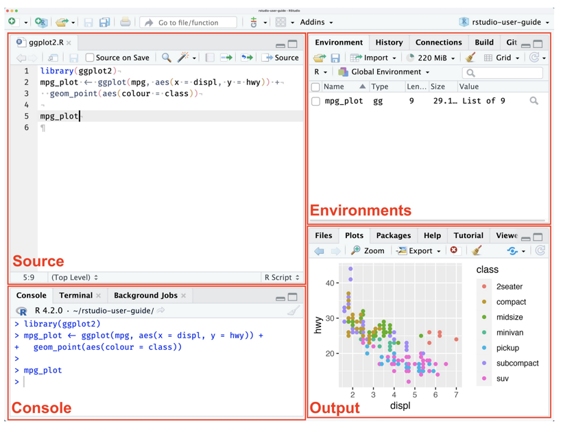

```{r setup, include=FALSE}
knitr::opts_chunk$set(echo = TRUE)
```

## Introduction

The session focuses on a practical introduction to the calculation and interpretation of bioactivity similarity, with visual outputs (i.e. step 3 in the overall grouping workflow)



&nbsp;

The training will use existing code developed by Michabo Health Science Limited, and run within R (and R studio) which should be installed on the trainees local computer.

Working individually or in pairs, attendees will self-pace their progress through the training material and example data provided.


The tutorial should be followed from the link below:

- https://michabohealthscience.github.io/training-fsa/


Data is downloaded as we go through the tutorial. However all the materials including code and and data is available on Github as well:

- https://github.com/michabohealthscience/training-fsa/


## Training sections

The training has five stages

1. [Data](1_data.html) - Where we introduce the example omics dataset we are using from the Cefic MATCHING project [@viant2024demonstrating] **(15 minutes)**
2. [Data processing](2_data_processing.html) - Where we read in the processed dataset [@viant2024demonstrating] **(15 minutes)**
3. [Quality assessments](3_qa.html) - A brief note on quality assessments **(5 minutes)**
4. [Differentially abundant molecules - statistical analysis](4_stats.html) - Where we assess the bioactivity of the dataset and generate the input for the grouping **(20 minutes)**
5. [Grouping](5_grouping.html)  - Where we use metrics generated from the univariate statistical analysis from the prior step to perform grouping **(30 minutes)**
6. [More info](6_more_info.html) - Further details for those that are interested.


## R (and R Studio) 

R (and R Studio) with the majority of the packages should already be pre-installed on all the trainees computers. 

See below for a reminder of the different panels will be using in R Studio today


&nbsp;


## References